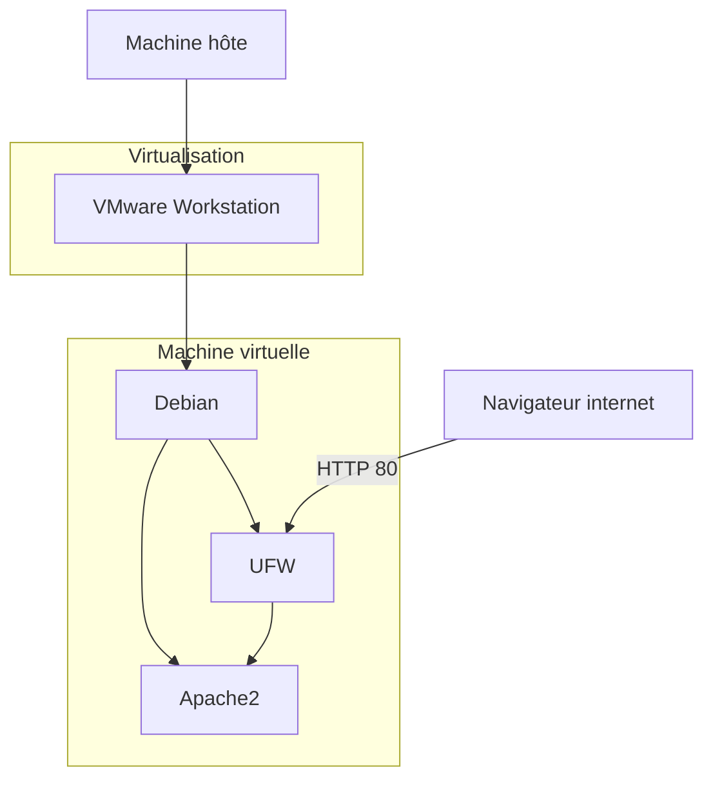

#### Sommaire
- [Lab 01 — Infrastructure \& Réseaux](#lab-01--infrastructure--réseaux)
  - [Objectifs](#objectifs)
  - [Architecture du lab01-infra.reseau](#architecture-du-lab01-infrareseau)

# Lab 01 — Infrastructure & Réseaux
## Objectifs

L'objectif de ce lab est de s'exercer spécifiquement sur :
1. l'observation des processus et logs système
2. la gestion des permissions 
3. l'utilisation de
   1. **UFW**
   2. **Apache2**
   3. **nmap**

Plus globalement, ce lab permet également de progresser sur :
- l'exploration du système Linux grâce aux commandes `tree`. 
- Observation de l'activité du système grâce aux commandes `ps` et `htop`.

Les commandes telles que `ls`, `cd`, `find` et d'autres font parties d'un socle de connaissance de fond qui ne sera pas explicitement mis en avant, dans ce lab ni dans les prochains. 

## Architecture du lab01-infra.reseau

