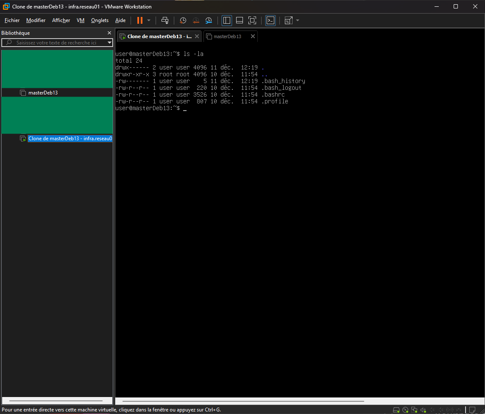

2#### Sommaire
- [Installation de la machine virtuelle](#installation-de-la-machine-virtuelle)
  - [Paramétrage initial](#paramétrage-initial)
  - [Mise à jour](#mise-à-jour)
- [Installation des différents services](#installation-des-différents-services)
- [Problèmes rencontrés](#problèmes-rencontrés)

#### Objectifs

Ce document décrit l’installation de l’environnement nécessaire au lab.
L’objectif est de disposer d’une machine Linux fonctionnelle, accessible en SSH, comportant des services essentiels au déroulement du lab, comme nmap, Apache.

---


# Installation de la machine virtuelle
## Paramétrage initial

- Logiciel : VMware Wokstation
- Type : Linux
- Version : Debian 13.3.0
- Mémoire : 2 Go
- CPU : 2 vCPU
- Disque : 20 Go (VDI, allocation dynamique)
- Carte réseau : **Bridge**
  - Ce mode permet ensuite de se connecter à un service Apache à partir de la machien hôte de la VM.
- Langue : Anglais
- CLI (**sans GNOME ni environnement de bureau**)
- Fuseau horaire : Europe/Paris
- Installation du serveur OpenSSH : Oui

<p align="center">
  
  <br>
  <em>Installation réussie via VMware</em>
</p>


## Mise à jour

```bash
sudo apt update && sudo apt upgrade -y
```
permet de mettre à jour l'OS.

```bash
lsb_release -a
ip a
```
sont des commandes qui respectivements permettent de témoigner de la version de l'OS utilisé, ainsi que de l'adresse IP de la machine virtuelle, utile pour s'y connecter en SSH.


# Installation des différents services

```bash
apt install -y nmap curl sudo ufw
```
permet d'installer les services suivants :
- nmap 
- curl 
- sudo
- **ufw**
- **apache2**

Ces services seront utiles dans ce lab ou ultérieurement grâce à des clones de cette machine.

# Problèmes rencontrés

> *Le navigateur n'arrive pas à se connecter au serveur Apache, alors que la commande curl parvient malgré tout à récupérer le contenu HTML.*

La carte réseau était fixée sur **NAT**, et non pas sur **Bridge**.
Le mode Bridge intègre la VM dans le réseau comme étant une machine à part entière, et non plus "cachée" derrière la machine hôte. Une machine configurée en NAT n'accepte pas les connexions entrantes. Une connexion sur le serveur Apache via l'interface web de la machine hôte est voué à l'échec, sauf si du port forwarding est réalisé.