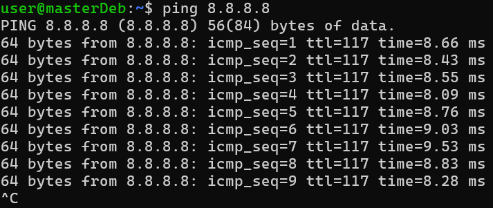
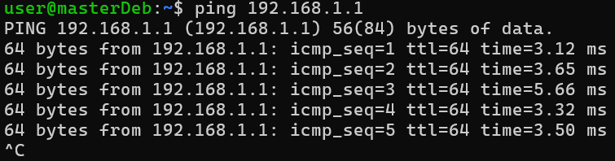
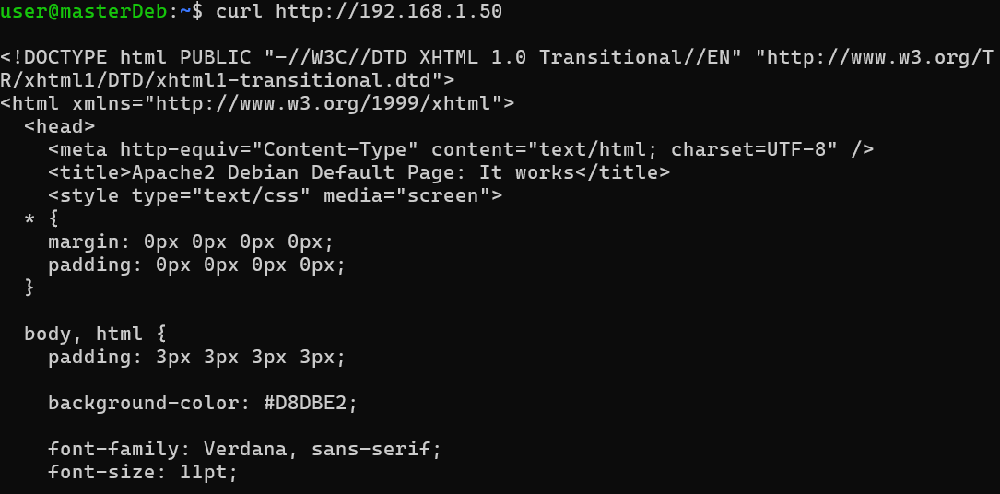

#### Sommaire
- [Diagnostic réseau](#diagnostic-réseau)
    - [Configuration réseau](#configuration-réseau)
  - [Commandes importantes pour le diagnostic](#commandes-importantes-pour-le-diagnostic)
  - [Scan réseau grâce à nmap](#scan-réseau-grâce-à-nmap)
- [Tests de connectivité depuis la VM](#tests-de-connectivité-depuis-la-vm)


# Diagnostic réseau
### Configuration réseau

Comment mentionné dans le document installation.md, la VM est configurée en **mode Bridge**. 
Cela permet :  
- À la VM d’obtenir une adresse IP sur le même réseau local que l’hôte.  
- À l’hôte et aux autres machines du réseau local d’accéder directement à la VM.  
- De simplifier (/permettre) les tests de services (SSH, HTTP) depuis l’hôte.  

Le mode NAT aurait permis à la VM d’accéder à Internet, mais l’hôte ne peut pas se connecter directement aux services exposés.
## Commandes importantes pour le diagnostic

| Commande | Description |
|----------|-------------|
| `ip a` | Liste les interfaces réseau et leurs adresses IP. |
| `ip route` | Affiche la table de routage, utile pour vérifier la passerelle par défaut. |
| `ss -tulpen` | Liste les ports ouverts et les services en écoute.<br>Paramètres :<br>- t : TCP<br>- u : UDP<br>- l : listening<br>- p : montre le PID et le nom du processus<br>- e : informations étendues<br>- n : sans résolution DNS |
| `ping <IP>` | Teste la connectivité avec une autre machine ou une passerelle. |
| `curl http://<IP>` | Teste l’accès à un service HTTP depuis la VM. |


## Scan réseau grâce à nmap
 
```bash
nmap 192.168.1.50 #IP de la VM
```
permet de connaitre les ports et services en écoute. La mention de http sur le port 80 désigne Apache.
Voici le prompt qui en résulte :
```bash
Starting Nmap 7.95 ( https://nmap.org ) at 2026-03-05 15:52 CET
Nmap scan report for masterDeb (192.168.1.50)
Host is up (0.00014s latency).
Not shown: 996 closed tcp ports (conn-refused)
PORT     STATE SERVICE
80/tcp   open  http
139/tcp  open  netbios-ssn
445/tcp  open  microsoft-ds
2222/tcp open  EtherNetIP-1
```


# Tests de connectivité depuis la VM

`ping 8.8.8.8` vérifie la connexion Internet :

<p align="center">
  
  <br>
  <em>Installation réussie via VMware</em>
</p>


`ping 192.168.1.1` vérifie la connexion à la passerelle locale

<p align="center">
  
  <br>
  <em>Installation réussie via VMware</em>
</p>


`curl http://192.168.1.50` vérifie que le service Apache répond.

<p align="center">
  
  <br>
  <em>Installation réussie via VMware</em>
</p>
