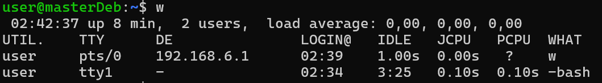
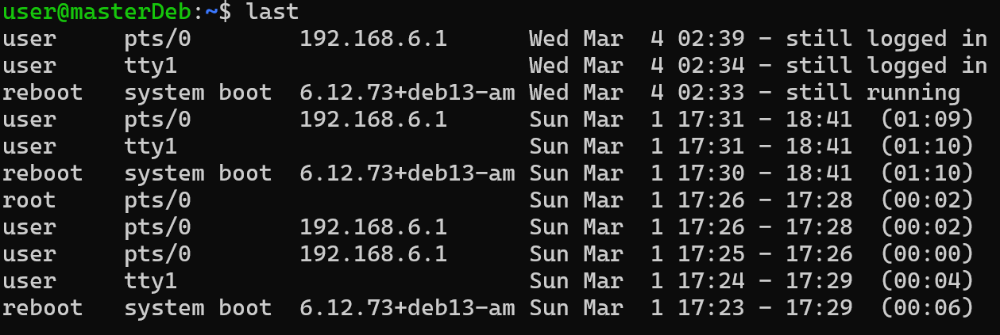
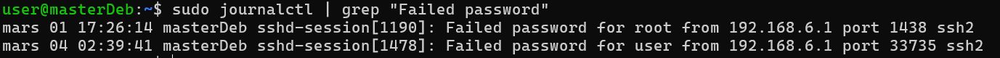

#### Sommaire
- [Configuration de root et SSH](#configuration-de-root-et-ssh)
  - [Désactivation de l'authentification par root](#désactivation-de-lauthentification-par-root)
  - [Désactivation de la connexion de root en SSH](#désactivation-de-la-connexion-de-root-en-ssh)
  - [Modification du port SSH](#modification-du-port-ssh)
  - [Sécurisation du fichier de configuration de SSH](#sécurisation-du-fichier-de-configuration-de-ssh)
- [UFW](#ufw)
  - [Gestion des règles de UFW](#gestion-des-règles-de-ufw)
  - [Installation et configuration de UFW](#installation-et-configuration-de-ufw)
    - [Autorisation du flux TCP sur le port 2222](#autorisation-du-flux-tcp-sur-le-port-2222)
    - [Activation du service UFW](#activation-du-service-ufw)
    - [Explication de la commande "ufw status numbered"](#explication-de-la-commande-ufw-status-numbered)
- [Logs et authentifications](#logs-et-authentifications)
  - [Connexions et historique](#connexions-et-historique)
    - [Différence entre journalctl et logs classiques](#différence-entre-journalctl-et-logs-classiques)

---
# Configuration de root et SSH
## Désactivation de l'authentification par root

`sudo passwd -S root`
"root P" apparait. Le "P" indique que le compte root possède un mot de passe qui permet l'authentification.
`sudo passwd -l root`
`sudo passwd -S root`
"root L" apparait. Le "L" indique que le compte root est "Locked", signifiant qu'il est impossible de s'authentifier avec.


## Désactivation de la connexion de root en SSH

L’accès SSH direct au compte `root` est désactivé afin de réduire la surface d’attaque et d’améliorer la traçabilité des actions d’administration. Il faut utiliser la commande suivante pour parvenir à cela :
`sudo nano /etc/ssh/sshd_config`

puis rechercher la ligne PermitRootLogin, et lui indiquer le paramètre `no` de cette manière :
`PermitRootLogin no`

A chaque tentative de connexion en SSH via le compte de root, la permission sera refusée.


## Modification du port SSH 

```bash
sudo nano /etc/ssh/sshd_config
```
Il est possible de changer le port qu'utilise SSH en éditant le document `sshd_config`. 
L'utilisation de la commande précédente permet de remplacer le `Port 22` par un autre. 
J'ai décidé de prendre 2222. J'ai décommenté la ligne, et modifié le port. 


***INSERER UNE CAPTURE DECRAN***

> C'est dans ce fichier que l'on paramètre les permissions, -et donc l'impossibilité- de connexion en root via SSH.

Après redémarrage du service, via la commande `sudo systemctl restart ssh`, on peut vérifier la réussite du processus en utilisant la commande : 
`ss -tulpen | grep ssh`
où l'on témoigne que le résultat passe de :
`LISTEN 0 128 0.0.0.0:22` -> `LISTEN 0 128 0.0.0.0:2222`.

## Sécurisation du fichier de configuration de SSH

```bash
ls -la /etc/ssh/sshd_config
```
permet de déterminer quelles sont les permissions accordées sur le fichier en question.
```bash
`-rw-r--r-- 1 root root 3409  1 mars  17:31 /etc/ssh/sshd_config`
```

`sudo chown root:root /etc/ssh/sshd_config`


# UFW
##  Gestion des règles de UFW

```bash
sudo ufw allow
sudo ufw deny
```
Ces commandes permettent de respectivement ajouter une règle pour autoriser (`allow`) et interdire (`deny`) la connexion.

```bash
sudo ufw delete
```
Cete commande permet de supprimer (`delete`) une règle définie. 
Il faut indiquer le nom de la règle à la suite de cette commande pour que cela fonctionne. 

> Par exemple, pour supprimer une règle autorisant la connexion sur le port 80, il faut entrer `sudo ufw delete allow 80/tcp`.


## Installation et configuration de UFW

```bash
sudo apt install ufw
```
permet d'installer UFW.

```bash
sudo ufw default deny incoming
```
permet de renseigner la règle selon laquelle le trafic entrant est filtré par UFW, sauf contre-indication.

```bash
sudo ufw default allow outgoing
```
permet de renseigner une seconde règle définissant que le trafic sortant est autorisé par UFW.

### Autorisation du flux TCP sur le port 2222

```bash
sudo ufw allow 2222/tcp
```
permet d'autoriser le flux TCP sur le port 2222, soit donc la connexion en SSH sur ce dernier, **le service SSH ayant été précédemment défini sur 2222.**

### Activation du service UFW

```bash
sudo ufw enable
sudo ufw status numbered
```
- `enable` permet d'activer le service et de mettre en rigueur les règles précédemment définies.
- `status numbered` sert à afficher les règles du firewall UFW avec un numéro associé à chaque règle. Ces numéros permettent ensuite de supprimer ou modifier facilement une règle.


### Explication de la commande "ufw status numbered"

```bash
sudo ufw status verbose
Status: active
Logging: on (low)
Default: deny (incoming), allow (outgoing), disabled (routed)
New profiles: skip

To                         Action      From
--                         ------      ----
2222/tcp                   ALLOW IN    Anywhere
2222/tcp (v6)              ALLOW IN    Anywhere (v6)
```


- `Logging: on (low)` : le pare feu est actif; "low" désigne le fait que le journal tenu est de faible intensité, si l'on peut définir cela ainsi. 
  Les paramètres **medium**, **high** et **full** sont des paramètres respectivement qui journalisent plus mais qui sont plus lourds. 
> **Low convient très bien pour une surveillance standard**, et notamment pour un lab comme le nôtre.

- `Default: deny (incoming), allow (outgoing)` : les règles par défault ajoutées précédemment.

- `2222/tcp ALLOW IN Anywhere` : seul SSH est autorisé, sur le port qui a été modifié.

> Tous les autres ports sont bloqués, ce qui est la bonne pratique conformément au principe du moindre privilège.


# Logs et authentifications
## Connexions et historique

```bash
w
```
permet de vor les connexions actuelles. On témoigne de cela de cette manière :
<p align="center">
  
  <br>
  <em></em>
</p>

```bash
last
```
permet de voir les dernières connexions.
<p align="center">
  
  <br>
  <em></em>
</p>

```bash
sudo journalctl -u ssh
```
permet d'avoir un historique beaucoup plus détaillé des connexions réalisées. 
`-u` en paramètre permet de spécifier une "unité". C'est l'équivalent d'un service dans journalctl. Cela permet de filtrer.

```bash
sudo journalctl | grep "Failed password"
```
permet de filtrer les résultats pour n'avoir que les échecs de connexions 
<p align="center">
  
  <br>
  <em>Résultat de la commande sudo journalctl | grep "Failed Password"</em>
</p>

```bash
sudo journalctl -u ssh -f
```
permet de suivre en temps réel les connexions SSH
`-f` est le paramètre permettant de suivre en temps réel le log.

### Différence entre journalctl et logs classiques
