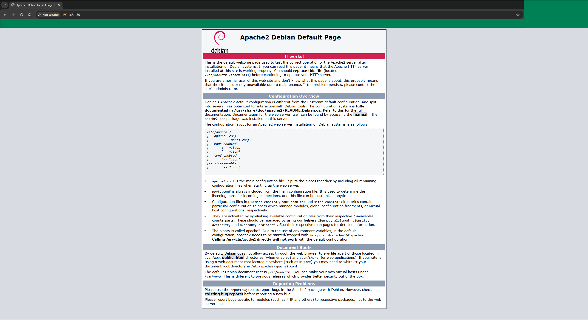
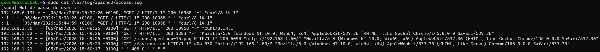

### Installation Apache / Nginx

`sudo apt install apache2`
Vérification :
Pour se connecter via le navigateur sur la page web Apache, il faut que la VM soit en bridge, que le port 80 soit autorisé par UFW `sudo ufw status verbose`, et que le service soit lancé.


#### Service actif

`sudo systemctl status apache2` permet de vérifier que le service Apache est bien exécuté.
Le résultat de cette commande est le suivant :
```bash
apache2.service - The Apache HTTP Server
     Loaded: loaded (/usr/lib/systemd/system/apache2.service; enabled; preset: enabled)
     Active: active (running)
```


#### Port à l’écoute

`nmap 192.168.1.50` (l'IP de la VM) permet de connaitre les ports et services en écoute. La mention de http sur le port 80 désigne Apache.
```bash
Starting Nmap 7.95 ( https://nmap.org ) at 2026-03-05 15:52 CET
Nmap scan report for masterDeb (192.168.1.50)
Host is up (0.00014s latency).
Not shown: 996 closed tcp ports (conn-refused)
PORT     STATE SERVICE
80/tcp   open  http
139/tcp  open  netbios-ssn
445/tcp  open  microsoft-ds
2222/tcp open  EtherNetIP-1
```


#### Test depuis l’hôte
<p align="center">
  
  <br>
  <em>Test de connexion sur la page web du service Apache</em>
</p>

`sudo cat /var/log/apache2/access.log` permet d'accéder aux logs d'accès de Apache

<p align="center">
  
  <br>
  <em>Logs d'accès de Apache</em>
</p>