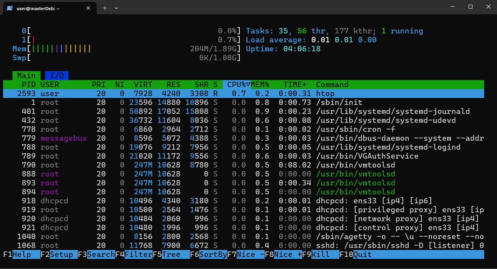
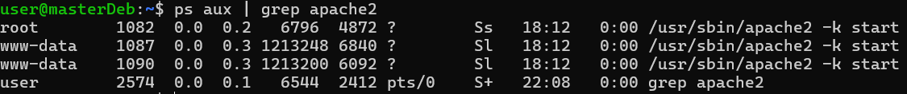

#### Sommaire
- [Permissions](#permissions)
  - [Définitions des permissions](#définitions-des-permissions)
  - [chmod, chown](#chmod-chown)
  - ["user n'est pas dans le dossier sudoers"](#user-nest-pas-dans-le-dossier-sudoers)
- [Processus](#processus)
    - [ps](#ps)
    - [top et htop](#top-et-htop)
      - [Verification pratique avec Apache](#verification-pratique-avec-apache)
    - [Kill](#kill)

# Permissions
## Définitions des permissions
-rw-r--r--
││ │ │ │
││ │ │ └── autres : lecture
││ │ └──── groupe : lecture
││ └────── propriétaire : lecture + écriture
│└──────── type de fichier
└───────── permissions

## chmod, chown

chmod et chown valent pour "change mode" et "change owner".
```bash
chmod
```
permet de changer les droits d'accès d'un fichier ou d'un répertoire.

```bash
chown
```
permet de changer le propriétaire d'un fichier ou d'un répertoire. 
>`chown` permet d'avoir un contrôle plus fin, notamment en terme de monitoring : définir et compter plutôt sur les droits d'un propriétaire plutôt que d'un groupe permet d'améliorer la tracabilité des actions.

## "user n'est pas dans le dossier sudoers"

Si l’utilisateur n’est pas dans le groupe `sudo`, il ne peut pas exécuter de commandes avec élévation de privilèges.
```bash
usermod -aG sudo user
``` 
permet de donner les droits d'élévation de privilèges temporaires à user.
- `-a` = append (ne supprime pas les autres groupes)
- `G` = groupes

En utilisant la commande `groups` à la suite, sudo apparait dans la liste de résultats, ce qui indique que le compte user peut utiliser cette commande.

# Processus
### ps

```bash
ps aux
```
permet d'afficher tous les processus en cours.

### top et htop
```bash
top
htop
```
permettent de voir tous les processus en cours, classés en fonction de ceux qui consomment le plus de ressources sur la machine. 
>`htop` est un paquet à installer **qui est plus complet et moderne que top.**

<p align="center">
  
  <br>
  <em>Visualisation des processus avec htop</em>
</p>

```bash
ps aux | grep ssh
```
permet d'afficher uniquement les processus concernant SSH parmis l'entièreté des processus.

#### Verification pratique avec Apache

```bash
ps aux | grep apache2
```

<p align="center">
  
  <br>
  <em>Affichage des processus contenant "apache2"</em>
</p>

### Kill
```bash
sudo kill <PID>
sudo kill -9 <PID>
```
permettent de terminer un service, renseigné par son Processus Identifier.
Ajoute le paramètre `-9` permet de terminer un processus **de force**. Cela implique une potentielle corruption de fichiers, ou une perte de donnnées, mais est plus efficace si la tâche résiste. 

> Il faut noter que certains malwares résistent au sudo kill classique, qui envoie un signal de "terminate" (SIGTERM). Si un processus nécessite un signal "kill" (SIGKILL), cela est déjà un signe de comportement suspect.

PID
: Processus IDentifier.

